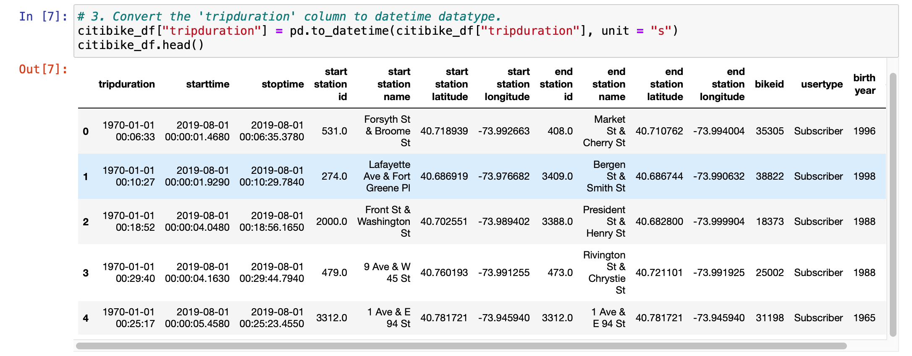
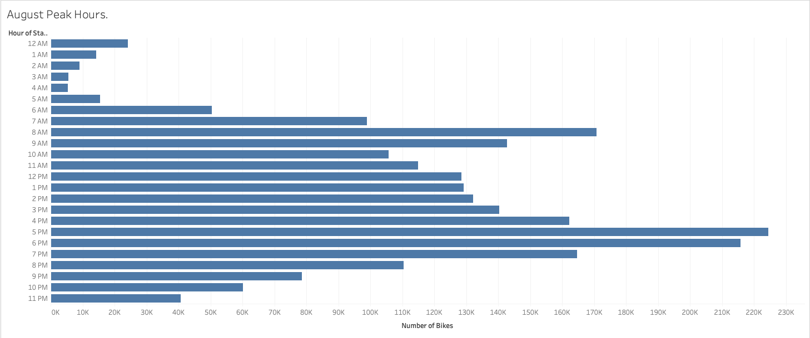
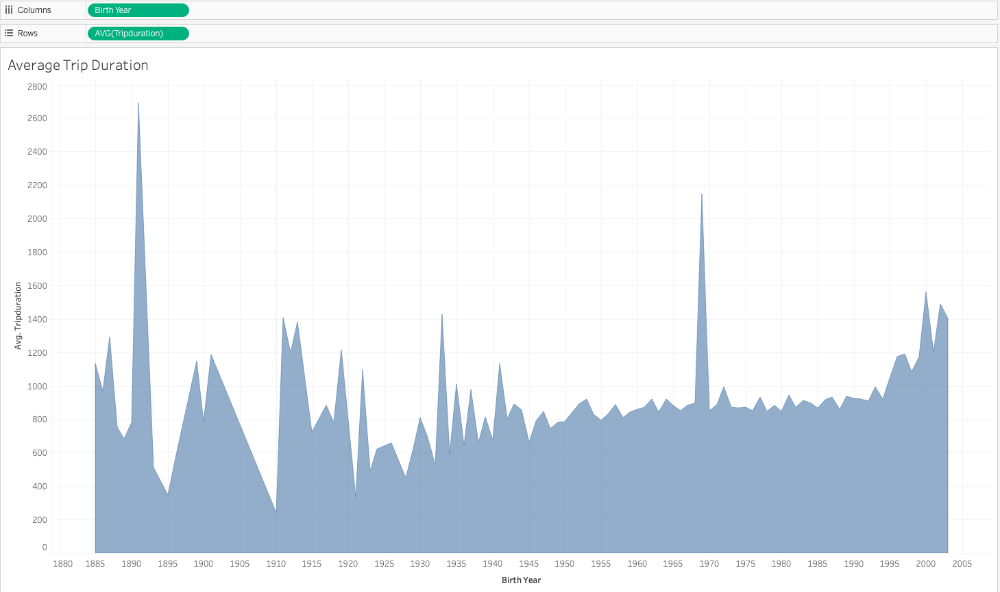
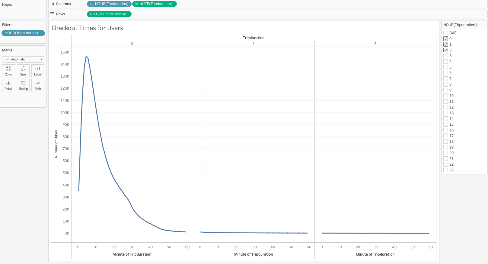
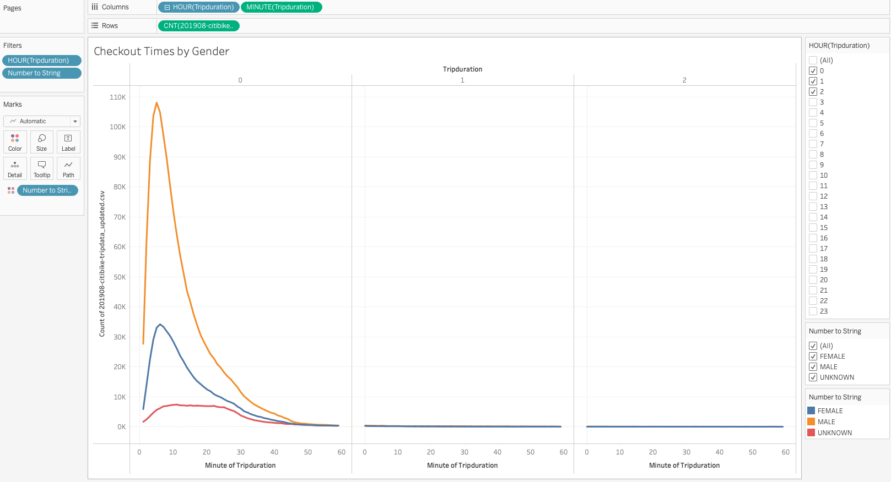
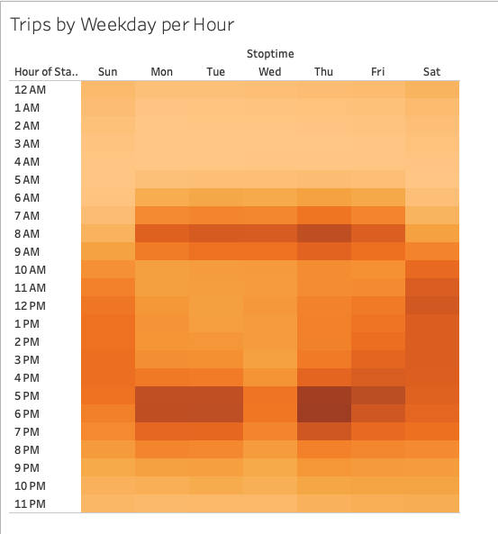
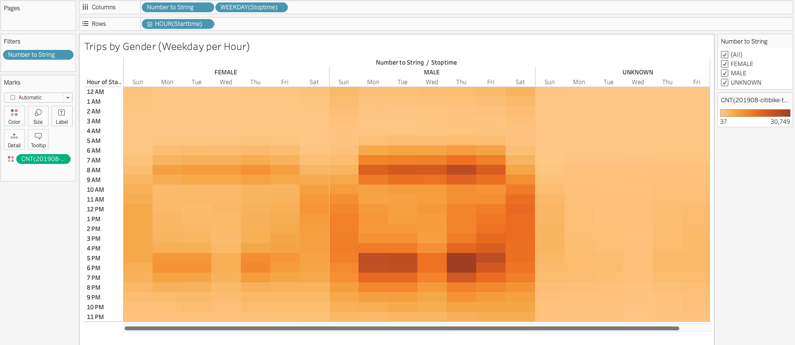
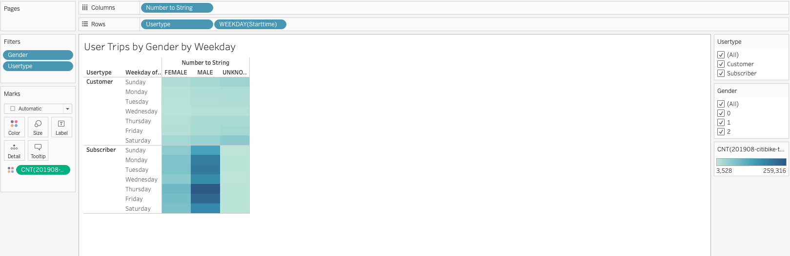

# bikesharing

## Overview :

This project was conducted to provide data visualizations as analysis of New York Citi Bike data for the 2019 August data for the town Des Moines. The tool used for exploratory analysis of bike-sharing business was Tableau. Pandas in python was used to convert the tripduration from string format to datetime format. The dataset was obtained from the source below:
- Data Source: [Citi Bike Data](https://www.citibikenyc.com/system-data), [201908-citibike-tripdata.csv.zip](https://s3.amazonaws.com/tripdata/201908-citibike-tripdata.csv.zip)

## Results:
The link to the Tableau story can be found here:
[Link to dashboard](https://public.tableau.com/app/profile/boakye.twum.donkor/viz/NYCCitibikeAnalysis1/NYCCitibikesAnalysis?publish=yes)

- Conversion of tripduration to dateTime format

Pandas in python was used for the conversion.

- August Peak hours

This shows the peak hours during which bike trips were made and a good time to schedule bike maintenance will be between 2am to 5am.

- Average Trip Duration

This shows older gerations/people tend to ride the bike for longer durations on average relative to the younger genration.

- Checkout by Users

Can be observed that the duration of most rides tend to be 20 minutes. 

- Checkout by Gender

Regardless of the gender, the patter is similar for trip durations.

- Trips by Weekday per Hour

The heatmap shows most trips were between 6am to 8p with the weekends experiencing more trips as well as morning and evening rush hours.

- Trips by Gender ( Weekday per Hour)

The males tend to make more trips relative to females observing similar partern as the population.

- User Trips by Gender by Weekday

Most trips are made by yearly subscibers reletive to on-demand customers.

Summary:

The results have provide much insights about the patronage of city bikes for the town of Des Moines having focused on the month of August for year 2019. Further recommendations for exploratory analysis to find our which stations were the busiest in relation to gender relative to other stations. Also we can explore the checkout times in relation to various age brackets.
